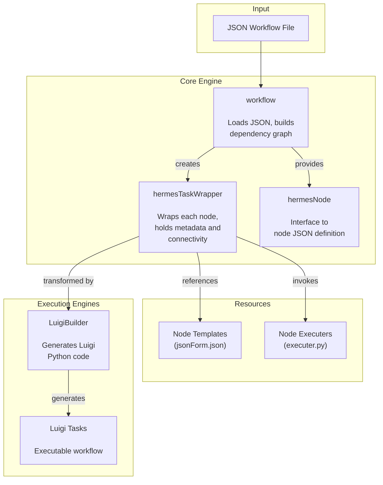
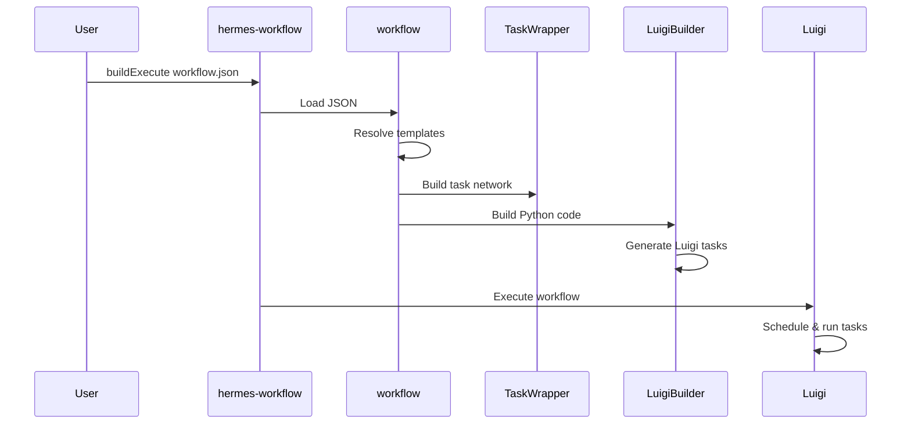

# Core Concepts

Hermes is built around three main abstractions: the **Workflow**, the **TaskWrapper**, and the **Node** system.

## Architecture Overview



## Workflow

The `workflow` class (`hermes/workflow/workflow.py`) is the central engine. It:

1. **Loads** a JSON workflow definition
2. **Resolves** node templates and default values
3. **Builds** a network of `TaskWrapper` objects representing the dependency graph
4. **Delegates** code generation to an execution engine (e.g., Luigi)

Key properties:

| Property | Description |
|----------|-------------|
| `json` | Full workflow JSON including GUI and final nodes |
| `workflowJSON` | The `workflow` section only |
| `nodeList` | Ordered list of node names |
| `nodes` | Node definitions dictionary |
| `parametersJSON` | Extracted parameters only |
| `taskRepresentations` | Map of node names to `TaskWrapper` lists |

## TaskWrapper

The `hermesTaskWrapper` class (`hermes/taskwrapper/wrapper.py`) is the frontend for engine transformation. Each wrapper holds:

- **Task name and type** — identifies the node
- **Input parameters** — with resolved path expressions
- **Dependencies** — both explicit (`requires`) and implicit (from parameter references)
- **Properties** — constant values

The wrapper extracts dependencies automatically from parameter mapping patterns like `{NodeName.output.Field}`.

## hermesNode

The `hermesNode` class provides a convenient interface to individual node JSON definitions. It offers:

- Dictionary-like access to node parameters
- `parametersTable` property for Pandas-formatted display
- Separation of execution config from GUI config

## Node System

Nodes are defined in `hermes/Resources/` with this structure:

```
hermes/Resources/
├── general/
│   ├── CopyDirectory/
│   │   ├── jsonForm.json      # Template with schema and defaults
│   │   └── executer.py        # Execution logic (optional)
│   ├── RunOsCommand/
│   └── ...
├── openFOAM/
│   ├── mesh/
│   │   ├── BlockMesh/
│   │   └── SnappyHexMesh/
│   ├── system/
│   ├── constant/
│   └── dispersion/
├── BC/
├── executers/                  # Shared execution logic
└── workbench/                  # FreeCAD workbench nodes
```

Each node type consists of:

1. **Template** (`jsonForm.json`) — defines the JSON schema, UI configuration, and default values
2. **Executer** — Python module that implements the actual task logic (inputs, outputs, run method)

## Dependency Resolution

Dependencies between nodes are resolved through two mechanisms:

1. **Parameter references** — `{NodeName.output.Field}` creates an implicit dependency
2. **Explicit requires** — the `requires` field lists direct dependencies

The workflow engine builds a complete dependency graph by analyzing both mechanisms, then passes this graph to the execution engine for scheduling.

## Execution Flow


