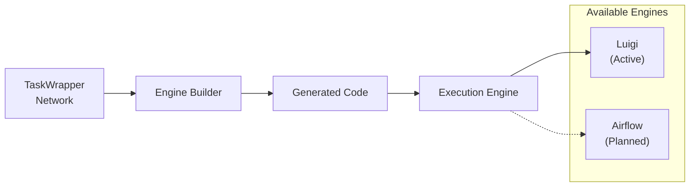

# Execution Engines

Hermes uses an abstraction layer to support multiple workflow execution engines. Currently, Luigi is the primary engine.

## Engine Architecture



## Luigi Engine

Located in `hermes/engines/luigi/`, the Luigi engine consists of:

### LuigiBuilder (`builder.py`)

The main builder that converts the TaskWrapper network into Luigi Python code:

1. **Generates imports** — standard Luigi imports and Hermes utilities
2. **Iterates task wrappers** — for each wrapper, finds the appropriate transformer
3. **Generates Luigi Task classes** — each node becomes a Luigi `Task` subclass
4. **Handles dependencies** — generates `requires()` methods from the dependency graph
5. **Generates output** — `output()` methods producing `LocalTarget` with JSON

### Task Generation Pattern

Each generated Luigi task follows this pattern:

```python
class NodeName(hermesLuigiTask):
    def requires(self):
        return [DependencyNode1(), DependencyNode2()]

    def output(self):
        return luigi.LocalTarget("NodeName.json")

    def run(self):
        # Map parameters from dependencies
        params = self._map_parameters(self.input())
        # Invoke the node executer
        result = executer.run(params)
        # Write output
        with self.output().open('w') as f:
            json.dump(result, f)
```

### Specialized Transformers

Some node types have specialized transformers that generate optimized Luigi code:

- OpenFOAM mesh nodes — handle mesh-specific execution patterns
- Workflow nodes — handle nested workflow execution

### Task Utilities (`taskUtils.py`)

Common utilities shared across generated tasks:

- Parameter mapping from dependency outputs
- Path resolution and file handling
- Error handling and logging

## Adding a New Engine

To add support for a new execution engine (e.g., Airflow):

1. Create a new directory: `hermes/engines/airflow/`
2. Implement a builder class that:
    - Accepts the TaskWrapper network
    - Generates engine-specific code (e.g., Airflow DAG Python file)
    - Maps task dependencies to the engine's dependency model
3. Register the engine name in the workflow's `build()` method

The key interface is:

```python
class MyEngineBuilder:
    def __init__(self, workflow):
        self.workflow = workflow

    def build(self):
        """Generate execution code for the engine."""
        # Iterate self.workflow.taskRepresentations
        # Generate engine-specific code
        pass
```

## Engine Selection

The engine is selected at build time:

```bash
hermes-workflow build workflow.json myCase  # defaults to Luigi
```

Currently only Luigi is supported, but the architecture is designed for multiple engines.
