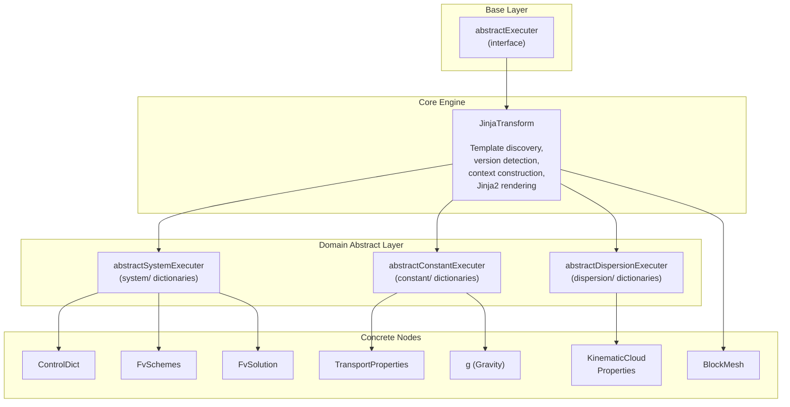
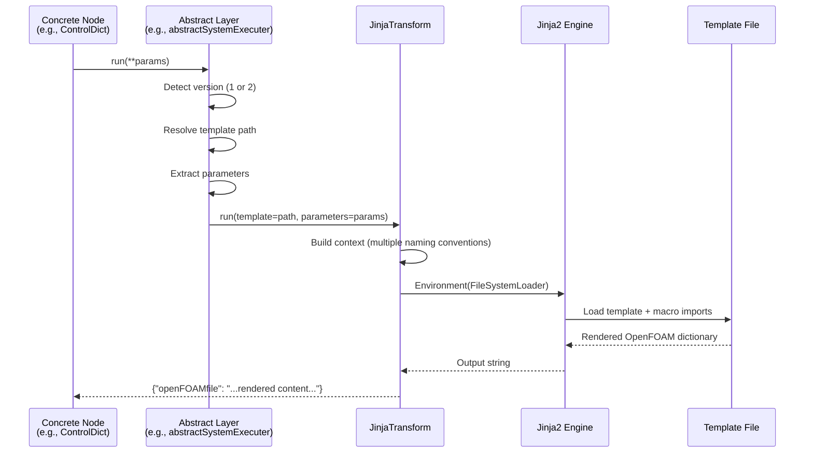

# The Jinja2 Template System

The JinjaTransform system is the core mechanism Hermes uses to generate OpenFOAM configuration files. It provides a layered architecture where domain-specific nodes inherit from a common Jinja2 rendering engine, and templates produce properly formatted OpenFOAM dictionaries from JSON parameters.

## Architecture



## How It Works

### 1. Template Discovery

When a node executer runs, it determines the template path based on the version:

**Version 1 (legacy):** Explicit template path passed by the abstract layer.

```
openFOAM/system/ControlDict/jinjaTemplate
openFOAM/constant/g/jinjaTemplate
openFOAM/mesh/BlockMesh/jinjaTemplate
```

**Version 2 (modern):** Template path derived from the node's `type` field.

```
openFOAM.system.FvSchemes → openFOAM/system/FvSchemes/jinjaTemplate.v2
openFOAM.constant.g       → openFOAM/constant/g/jinjaTemplate.v2
openFOAM.mesh.BlockMesh   → openFOAM/mesh/BlockMesh/jinjaTemplate.v2
```

Templates are loaded from `hermes/Resources/` using Jinja2's `FileSystemLoader`.

### 2. Context Construction

The `JinjaTransform.run()` method builds a flexible rendering context so templates can access parameters in multiple ways:

```python
ctx = {}

# All parameters available at top level
ctx.update(parameters)

# Known nested keys promoted for convenience
for key in ["fields", "default", "values", "solverProperties",
            "relaxationFactors", "parameters"]:
    if key in parameters and isinstance(parameters[key], dict):
        ctx[key] = parameters[key]

# Fallback defaults
ctx.setdefault("input_parameters", parameters)
ctx.setdefault("values", parameters)
ctx.setdefault("parameters", parameters)
```

This means a template can access the same data as `{{ nu }}`, `{{ values.nu }}`, or `{{ input_parameters.nu }}`.

### 3. Template Rendering

The Jinja2 environment is configured with:

```python
env = Environment(
    loader=FileSystemLoader(resources_root),
    trim_blocks=True,      # Remove newline after block tags
    lstrip_blocks=True      # Remove leading whitespace before block tags
)
```

No custom filters or globals are added — all transformation logic uses standard Jinja2 features and imported macro files.

## The Inheritance Chain

### JinjaTransform (core)

**File:** `hermes/Resources/general/JinjaTransform/executer.py`

The base class handles:

- Resource directory resolution
- Version detection (v1 vs v2)
- Template loading via `FileSystemLoader`
- Context construction with multiple naming conventions
- Rendering and error handling

### abstractSystemExecuter

**File:** `hermes/Resources/openFOAM/system/abstractSystemExecuter.py`

Wraps JinjaTransform for `system/` dictionaries with version-aware template loading:

```python
class abstractSystemExecuter(JinjaTransform):
    def __init__(self, JSON, templateName):
        super().__init__(JSON)
        self.templateName = templateName

    def run(self, **executer_parameters):
        version = self._JSON.get("version", 1)
        if version == 2:
            node_type = self._JSON.get("type", "")
            templateName = node_type.replace(".", "/") + "/jinjaTemplate.v2"
            parameters = self._JSON.get("Execution", {}).get("input_parameters", {})
        else:
            templateName = f"openFOAM/system/{self.templateName}/jinjaTemplate"
            parameters = self._JSON
        return super().run(template=templateName, parameters=parameters)
```

### abstractConstantExecuter

**File:** `hermes/Resources/openFOAM/constant/abstractConstantExecuter.py`

Simpler v1-only wrapper for `constant/` dictionaries:

```python
class abstractConstantExecuter(JinjaTransform):
    def __init__(self, JSON, templateName):
        super().__init__(JSON)
        self.templateName = f"openFOAM/constant/{templateName}/jinjaTemplate"

    def run(self, **inputs):
        inputs.setdefault("template", self.templateName)
        return super().run(**inputs)
```

### abstractDispersionExecuter

**File:** `hermes/Resources/openFOAM/dispersion/abstractDispersionExecuter.py`

Direct template rendering for dispersion dictionaries:

```python
class abstractDispersionExecuter(JinjaTransform):
    def __init__(self, JSON, templateName):
        super().__init__(JSON)
        self.templateName = f"openFOAM/dispersion/{templateName}/jinjaTemplate"

    def run(self, **inputs):
        template = self._getTemplate(self.templateName)
        output = template.render(**inputs)
        return dict(openFOAMfile=output)
```

### Concrete Nodes

Most concrete nodes are minimal — they just pass their template name to the abstract layer:

```python
# hermes/Resources/openFOAM/system/ControlDict/executer.py
class ControlDict(abstractSystemExecuter):
    def __init__(self, JSON):
        super().__init__(JSON, "ControlDict")

# hermes/Resources/openFOAM/constant/g/executer.py
class g(abstractConstantExecuter):
    def __init__(self, JSON):
        super().__init__(JSON, "g")
```

Some nodes (like `FvSchemes`, `BlockMesh`) inherit directly from `JinjaTransform` with no additional code:

```python
class FvSchemes(JinjaTransform):
    pass
```

## Template Syntax

### OpenFOAM Dictionary Output

Templates produce raw OpenFOAM dictionary file content. Here's a simplified example from `TransportProperties`:

```jinja2
transportModel  {{ transportModel }};
nu              [0 2 -1 0 0 0 0] {{ nu }};


rhoInf          [1 -3 0 0 0 0 0] {{ rhoInf }};

```

### Variable Substitution

```jinja2
application     {{ values.application }};
endTime         {{ values.endTime }};
deltaT          {{ values.deltaT }};
```

### Conditionals

```jinja2
{# Boolean to OpenFOAM yes/no #}
runTimeModifiable  yes  no ;

{# Inline conditional #}
default {{ "yes" if input_parameters.fluxRequired.default else "no" }};

{# Optional field #}

rhoInf  [1 -3 0 0 0 0 0] {{ rhoInf }};

```

### Loops

```jinja2
{# Iterate vertices #}
vertices (
    
    ({{ v[0] }} {{ v[1] }} {{ v[2] }})
    
);

{# Iterate dictionary items #}

    
    grad({{ fieldName }}) {{ fieldData.gradScheme.type }};
    


{# Loop with filter #}

    {{ name }} {{ value }};

```

### Macro Imports

Templates can import shared macros from utility files:

```jinja2


vertices (
    
    {{ utils.toPoint(pnt) }}
    
);
```

### Whitespace Control

The `-` character in `` removes whitespace around tags, essential for producing clean OpenFOAM files:

```jinja2

   "{{ lib }}"

```

## Shared Macro Libraries

### `openFOAM/utils.jinja`

**File:** `hermes/Resources/openFOAM/utils.jinja`

Common utility macros used across templates:

| Macro | Purpose | Example Output |
|-------|---------|----------------|
| `toPoint(pt)` | Convert point to OpenFOAM tuple | `(0 0 0)` |
| `toSwitch(val)` | Boolean → `on`/`off` | `on` |
| `toBool(var)` | Boolean → `true`/`false` | `true` |
| `asTokens(val)` | Value → space-separated tokens | `Gauss linear` |
| `toList(lst)` | List → parenthesized values | `(1 2 3)` |
| `handleValue(params)` | Render key-value pairs with `;` | `nu 1e-06;` |

**`toPoint` example** — handles multiple input formats:

```jinja2

    
        ({{ pt | replace('[','') | replace(']','') | replace(',',' ') | trim }})
    
        ({{ pt | join(' ') }})
    
        {{ pt }}
    

```

### `openFOAM/system/FvSolution/solvers.jinja`

**File:** `hermes/Resources/openFOAM/system/FvSolution/solvers.jinja`

Specialized macros for linear solver configuration:

| Macro | Purpose |
|-------|---------|
| `solver(fieldName, solverData, final)` | Dispatch to solver-specific macro |
| `PCG(...)` | Preconditioned Conjugate Gradient |
| `PBiCG(...)` | Preconditioned Bi-Conjugate Gradient |
| `GAMG(...)` | Geometric-Algebraic Multi-Grid |
| `smoothSolver(...)` | Smooth Solver |
| `diagonal(...)` | Diagonal Solver |

Usage in templates:

```jinja2


solvers {
    
        {{ solvers.solver(fieldName, solverData) }}
    
}
```

## Version 1 vs Version 2

| Aspect | Version 1 | Version 2 |
|--------|-----------|-----------|
| Template file | `jinjaTemplate` | `jinjaTemplate.v2` |
| Template path | Explicit, passed by abstract layer | Derived from `type` field |
| Parameter access | `{{ values.param }}`, `{{ param }}` | `{{ input_parameters.param }}` |
| Parameters source | Entire JSON object | `Execution.input_parameters` only |
| Version marker | Default (no marker) | `"version": 2` in JSON |

**v2 is recommended** for new nodes — it provides cleaner parameter isolation and automatic template discovery.

## File Structure

Each node directory contains:

```
hermes/Resources/openFOAM/system/ControlDict/
├── executer.py          # Python executer (usually 3-5 lines)
├── jinjaTemplate        # Version 1 template
├── jinjaTemplate.v2     # Version 2 template (optional)
├── jsonForm.json        # Node parameters and GUI config
└── webGUI.json          # FreeCAD GUI definition (optional)
```

Macro libraries:

```
hermes/Resources/openFOAM/
├── utils.jinja                            # Common utility macros
└── system/FvSolution/solvers.jinja        # Solver-specific macros
```

## Execution Flow



## Writing a New Template

To create a new OpenFOAM node with Jinja2 templates:

### 1. Create the directory

```bash
mkdir hermes/Resources/openFOAM/system/MyDict/
```

### 2. Write the executer

```python
# executer.py
from ..abstractSystemExecuter import abstractSystemExecuter

class MyDict(abstractSystemExecuter):
    def __init__(self, JSON):
        super().__init__(JSON, "MyDict")
```

### 3. Write the template

For version 2 (`jinjaTemplate.v2`):

```jinja2

FoamFile
{
    version     2.0;
    format      ascii;
    class       dictionary;
    object      myDict;
}

myParameter     {{ input_parameters.myParameter }};


optionalParam   {{ input_parameters.optionalParam }};


myList
(
    
    {{ item }}
    
);
```

### 4. Define the JSON form

```json
{
    "type": "openFOAM.system.MyDict",
    "version": 2,
    "Execution": {
        "input_parameters": {
            "myParameter": "defaultValue",
            "items": []
        }
    }
}
```

The node is now available in workflows as `"type": "openFOAM.system.MyDict"`.
