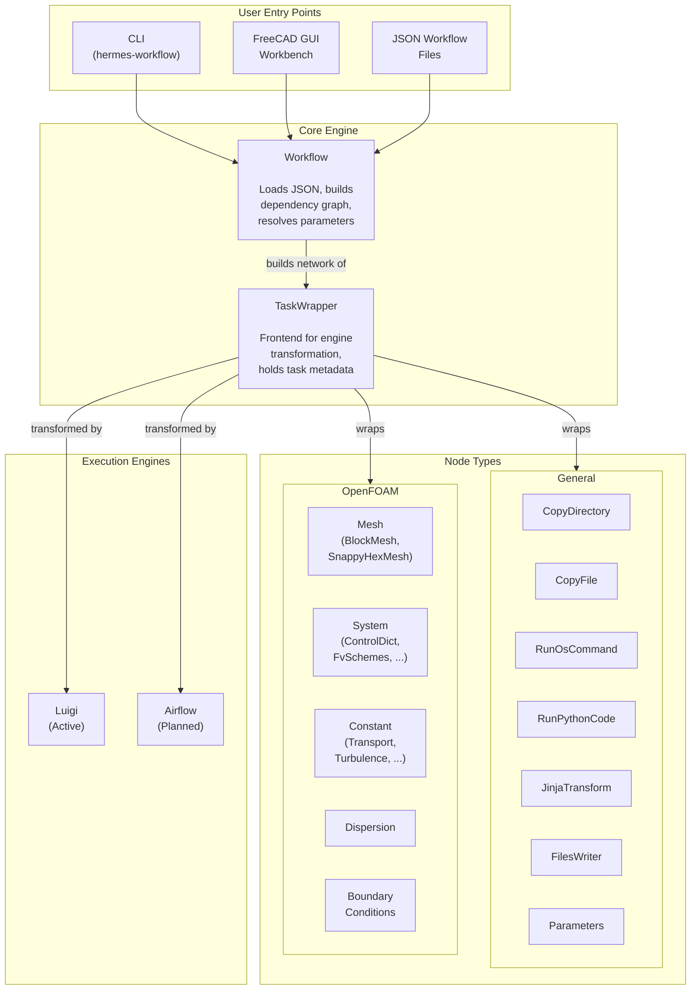

# Hermes Documentation

**Version 3.4.0** | Task-Based Workflow Automation for CFD & Simulation Pipelines

---

## What is Hermes?

Hermes is a Python framework for building task-based workflow pipelines, with a focus on CFD (Computational Fluid Dynamics) and structural simulation applications. Workflows are described in JSON format and executed via engines like [Luigi](https://luigi.readthedocs.io/) or [Airflow](https://airflow.apache.org/).

!!! tip "Quick Start"
    ```bash
    pip install -e .
    ```
    Then run a workflow:
    ```bash
    hermes-workflow buildExecute workflow.json
    ```

---

## High-Level Architecture



---

## Documentation Sections

### [User Guide](user_guide/index.md)

For users building and running workflows with Hermes.

| Section | Description |
|---------|-------------|
| [**Installation & Setup**](user_guide/installation.md) | Install Hermes and its dependencies |
| [**Key Concepts**](user_guide/concepts.md) | Workflows, nodes, JSON structure, execution engines |
| [**Quick Start Tutorial**](user_guide/quickstart.md) | Build your first workflow in 10 minutes |
| [**CLI Reference**](user_guide/cli.md) | `hermes-workflow` commands and options |
| [**Node Reference**](user_guide/nodes/index.md) | Complete guide to all general and OpenFOAM nodes |
| [**FreeCAD Integration**](user_guide/freecad.md) | Using the FreeCAD GUI workbench |
| [**Examples**](examples/index.md) | Workflow examples from simple to complex |

### [Developer Guide](developer_guide/index.md)

For developers extending Hermes — architecture, internals, and creating custom nodes.

| Section | Description |
|---------|-------------|
| [**Core Concepts**](developer_guide/architecture/core_concepts.md) | `workflow`, `TaskWrapper`, and node architecture |
| [**Workflow Engine**](developer_guide/architecture/workflow_engine.md) | How the workflow engine builds and resolves dependencies |
| [**Execution Engines**](developer_guide/architecture/execution_engines.md) | Luigi integration and adding new engines |
| [**JSON Structure**](developer_guide/json_structure.md) | Complete JSON schema reference for workflows and nodes |
| [**Creating Custom Nodes**](developer_guide/creating_nodes.md) | Step-by-step guide to adding new node types |
| [**API Reference**](developer_guide/api/workflow.md) | Python API documentation |

---

## Project Structure

```
Hermes/
├── hermes/                        # Main Python package
│   ├── bin/                       # CLI entry points
│   │   └── hermes-workflow        # Main CLI tool
│   ├── workflow/                  # Core workflow engine
│   ├── taskwrapper/               # Task wrapper abstraction
│   ├── engines/                   # Execution engine implementations
│   │   └── luigi/                 # Luigi engine (active)
│   ├── Resources/                 # Node type definitions & templates
│   │   ├── general/               # General-purpose nodes
│   │   ├── openFOAM/              # OpenFOAM simulation nodes
│   │   ├── BC/                    # Boundary condition nodes
│   │   └── workbench/             # FreeCAD workbench nodes
│   └── utils/                     # Utility modules
├── examples/                      # Workflow examples
├── freecad_source_hermes/         # FreeCAD integration source
├── doc/                           # Legacy Sphinx documentation
└── docs/                          # MkDocs documentation (this site)
```
