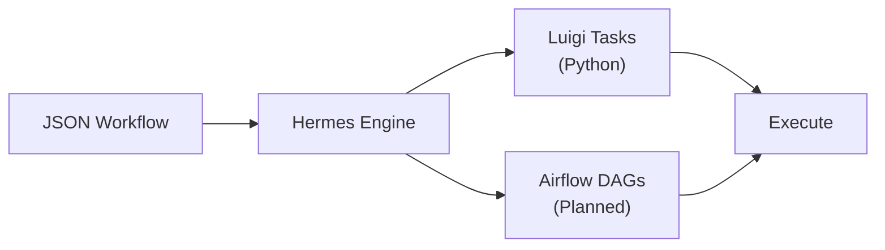

# Key Concepts

## Workflows

A **workflow** in Hermes is a directed acyclic graph (DAG) of tasks defined in JSON format. Each workflow consists of:

- A list of **nodes** that define individual tasks
- **Dependencies** between nodes (explicit or inferred from parameter references)
- An optional **root node** that identifies the workflow endpoint

```json
{
    "workflow": {
        "root": null,
        "nodeList": ["Node1", "Node2"],
        "nodes": {
            "Node1": { ... },
            "Node2": { ... }
        }
    }
}
```

## Nodes

A **node** is the fundamental unit of work in a Hermes workflow. Each node has:

- A **type** that determines its behavior (e.g., `general.CopyDirectory`, `openFOAM.mesh.BlockMesh`)
- **Input parameters** that configure the node
- **Output** values that can be referenced by other nodes
- Optional **dependencies** (`requires` field)

```json
{
    "CopyDirectory": {
        "Execution": {
            "input_parameters": {
                "Source": "source_dir",
                "Target": "target_dir",
                "dirs_exist_ok": true
            }
        },
        "type": "general.CopyDirectory"
    }
}
```

### Node Categories

| Category | Description | Examples |
|----------|-------------|----------|
| **General** | Basic file and code operations | CopyDirectory, RunOsCommand, JinjaTransform |
| **OpenFOAM Mesh** | Mesh generation nodes | BlockMesh, SnappyHexMesh |
| **OpenFOAM System** | Solver configuration | ControlDict, FvSchemes, FvSolution |
| **OpenFOAM Constant** | Physical properties | TransportProperties, TurbulenceProperties |
| **OpenFOAM Dispersion** | Dispersion modeling | KinematicCloudProperties |
| **Boundary Conditions** | Field boundary conditions | BC (ChangeDictionary) |

## Parameter References

Nodes can reference outputs from other nodes using path expressions:

```json
{
    "Parameters": {
        "source": "{CopyDirectory.output.Source}",
        "target": "{CopyDirectory.output.Target}"
    }
}
```

The `{NodeName.output.FieldName}` syntax creates an implicit dependency — Hermes ensures the referenced node completes before the current node executes.

## Templates

Nodes can be defined using **templates** that provide default values. A template reference replaces the full node definition:

```json
{
    "BlockMesh": {
        "Template": "openFOAM.mesh.BlockMesh.jsonForm"
    }
}
```

Templates are stored as `jsonForm.json` files in `hermes/Resources/` and define the schema, UI configuration, and default values for each node type.

## Execution Engines

Hermes translates JSON workflows into executable code for workflow engines:

- **Luigi** (currently supported) — generates Python Luigi task classes
- **Airflow** (planned) — future support for Apache Airflow DAGs

The engine abstraction means you write your workflow once in JSON and Hermes handles the translation to the target engine.



## FreeCAD Integration

For CFD workflows, Hermes provides a **FreeCAD workbench** that offers a GUI for:

- Setting workflow parameters visually
- Defining boundary conditions with 3D geometry
- Configuring mesh generation settings
- Managing simulation parameters

The workbench reads and writes the same JSON format, so workflows can be edited in the GUI or by hand.
