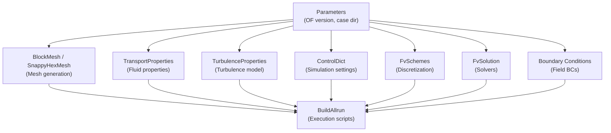

# OpenFOAM Nodes

OpenFOAM nodes generate configuration files for [OpenFOAM](https://www.openfoam.com/) CFD simulations. These nodes use Jinja2 templates to produce properly formatted OpenFOAM dictionaries.

## Node Categories

### [Mesh Generation](mesh/blockmesh.md)

| Node | Type | Description |
|------|------|-------------|
| [BlockMesh](mesh/blockmesh.md) | `openFOAM.mesh.BlockMesh` | Structured hexahedral mesh generation |
| [SnappyHexMesh](mesh/snappyhexmesh.md) | `openFOAM.mesh.SnappyHexMesh` | Automated mesh with snapping and layering |

### [System Configuration](system/controldict.md)

| Node | Type | Description |
|------|------|-------------|
| [ControlDict](system/controldict.md) | `openFOAM.system.ControlDict` | Simulation execution settings |
| [FvSchemes](system/fvschemes.md) | `openFOAM.system.FvSchemes` | Numerical discretization schemes |
| [FvSolution](system/fvsolution.md) | `openFOAM.system.FvSolution` | Linear solvers and convergence settings |

### [Constant Properties](constant/transport_properties.md)

| Node | Type | Description |
|------|------|-------------|
| [TransportProperties](constant/transport_properties.md) | `openFOAM.constant.TransportProperties` | Fluid transport properties (OF V7-V10) |
| [TurbulenceProperties](constant/turbulence_properties.md) | `openFOAM.constant.TurbulenceProperties` | Turbulence model settings (OF V7-V10) |
| [PhysicalProperties](constant/physical_properties.md) | `openFOAM.constant.PhysicalProperties` | General physical properties |
| [MomentumTransport](constant/momentum_transport.md) | `openFOAM.constant.MomentumTransport` | Momentum transport models |
| [BuildAllrun](constant/build_allrun.md) | `openFOAM.constant.BuildAllrun` | Generate allRun/allClean scripts |

### [Dispersion](dispersion/kinematic_cloud.md)

| Node | Type | Description |
|------|------|-------------|
| [KinematicCloudProperties](dispersion/kinematic_cloud.md) | `openFOAM.dispersion.KinematicCloudProperties` | Particle tracking properties |

### [Boundary Conditions](boundary_conditions.md)

| Node | Type | Description |
|------|------|-------------|
| [BC](boundary_conditions.md) | `BC.BoundaryCondition` | Field boundary conditions |

## Typical OpenFOAM Workflow

A complete OpenFOAM simulation workflow typically includes:

