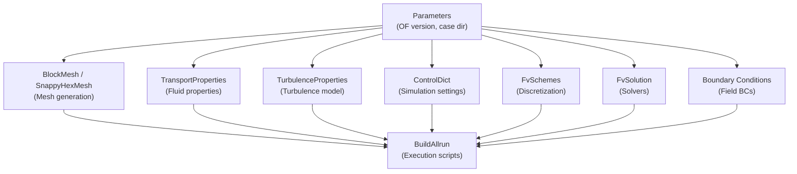

# OpenFOAM Nodes

OpenFOAM nodes generate configuration files for [OpenFOAM](https://www.openfoam.com/) CFD simulations. These nodes use Jinja2 templates to produce properly formatted OpenFOAM dictionaries.

## Node Categories

### [Mesh Generation](mesh/blockmesh.md)

| Node | Type | Description |
|------|------|-------------|
| [BlockMesh](mesh/blockmesh.md) | `openFOAM.mesh.BlockMesh` | Structured hexahedral mesh generation |
| [SnappyHexMesh](mesh/snappyhexmesh.md) | `openFOAM.mesh.SnappyHexMesh` | Automated mesh with snapping and layering |
| [GeometryDefiner](mesh/geometry_definer.md) | `openFOAM.mesh.GeometryDefiner` | Define geometry entities for meshing (FreeCAD) |
| [RefineMesh](mesh/refine_mesh.md) | `openFOAM.mesh.RefineMesh` | Mesh refinement operations |

### [System Configuration](system/controldict.md)

| Node | Type | Description |
|------|------|-------------|
| [ControlDict](system/controldict.md) | `openFOAM.system.ControlDict` | Simulation execution settings |
| [FvSchemes](system/fvschemes.md) | `openFOAM.system.FvSchemes` | Numerical discretization schemes |
| [FvSolution](system/fvsolution.md) | `openFOAM.system.FvSolution` | Linear solvers and convergence settings |
| [ChangeDictionary](system/change_dictionary.md) | `openFOAM.system.ChangeDictionary` | Modify field values and boundary conditions |
| [CreatePatch](system/create_patch.md) | `openFOAM.system.CreatePatch` | Create boundary patches from mesh faces |
| [DecomposePar](system/decompose_par.md) | `openFOAM.system.DecomposePar` | Domain decomposition for parallel runs |
| [FvConstraints](system/fv_constraints.md) | `openFOAM.system.FvConstraints` | Field constraints during simulation |
| [MeshQualityDict](system/mesh_quality_dict.md) | `openFOAM.system.MeshQualityDict` | Mesh quality criteria |
| [SetFields](system/set_fields.md) | `openFOAM.system.SetFields` | Initial field value setup |
| [SurfaceFeatures](system/surface_features.md) | `openFOAM.system.SurfaceFeatures` | Surface feature extraction for meshing |
| [TopoSetDict](system/topo_set_dict.md) | `openFOAM.system.TopoSetDict` | Topology set definitions (zones, regions) |

### [Constant Properties](constant/transport_properties.md)

| Node | Type | Description |
|------|------|-------------|
| [TransportProperties](constant/transport_properties.md) | `openFOAM.constant.TransportProperties` | Fluid transport properties (OF V7-V10) |
| [TurbulenceProperties](constant/turbulence_properties.md) | `openFOAM.constant.TurbulenceProperties` | Turbulence model settings (OF V7-V10) |
| [PhysicalProperties](constant/physical_properties.md) | `openFOAM.constant.PhysicalProperties` | General physical properties |
| [MomentumTransport](constant/momentum_transport.md) | `openFOAM.constant.MomentumTransport` | Momentum transport models |
| [ThermophysicalProperties](constant/thermophysical_properties.md) | `openFOAM.constant.ThermophysicalProperties` | Thermodynamic properties for heat transfer |
| [Gravity](constant/gravity.md) | `openFOAM.constant.g` | Gravitational acceleration vector |
| [WindLogProfile](constant/wind_log_profile.md) | `openFOAM.constant.homogenousWindLogProfileDict` | Atmospheric boundary layer wind profile |
| [BuildAllrun](constant/build_allrun.md) | `openFOAM.BuildAllrun` | Generate Allrun/Allclean execution scripts |

### [Dispersion](dispersion/kinematic_cloud.md)

| Node | Type | Description |
|------|------|-------------|
| [KinematicCloudProperties](dispersion/kinematic_cloud.md) | `openFOAM.dispersion.KinematicCloudProperties` | Lagrangian particle tracking |
| [MakeFlowDispersion](dispersion/make_flow_dispersion.md) | `openFOAM.dispersion.MakeFlowDispersion` | Prepare flow fields for dispersion |
| [Stable2018Dict](dispersion/stable_2018.md) | `openFOAM.dispersion.Stable2018Dict` | Stable atmospheric dispersion model |
| [Neutral2018Dict](dispersion/neutral_2018.md) | `openFOAM.dispersion.Neutral2018Dict` | Neutral atmospheric dispersion model |
| [Convective2018Dict](dispersion/convective_2018.md) | `openFOAM.dispersion.Convective2018Dict` | Convective atmospheric dispersion model |
| [IndoorDict](dispersion/indoor_dict.md) | `openFOAM.dispersion.IndoorDict` | Indoor environment dispersion model |

### [Boundary Conditions](boundary_conditions.md)

| Node | Type | Description |
|------|------|-------------|
| [BC](boundary_conditions.md) | `BC.BoundaryCondition` | Field boundary conditions |

## Typical OpenFOAM Workflow

A complete OpenFOAM simulation workflow typically includes:

