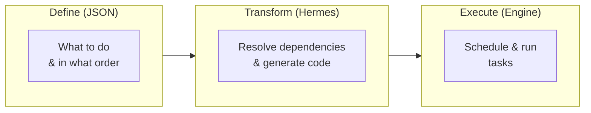
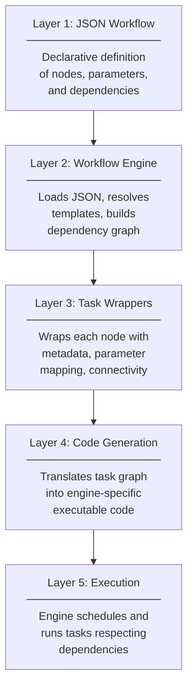
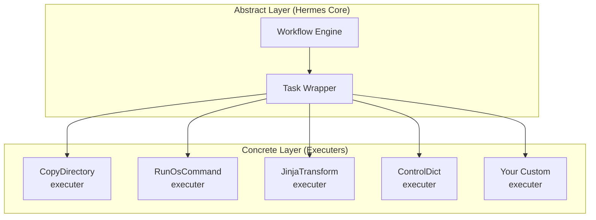
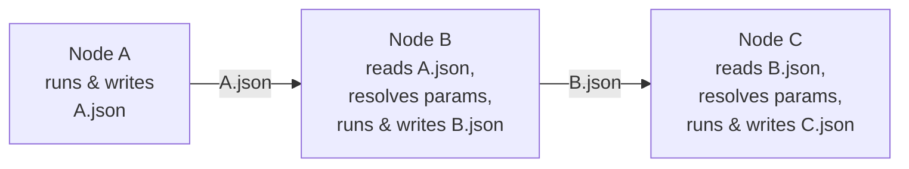
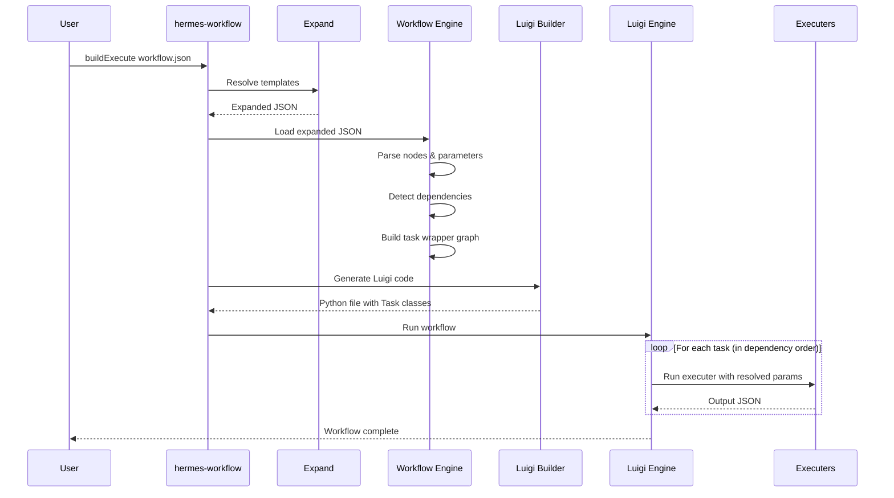

# The Hermes Pipeline

## Abstraction: From Instructions to Execution

At its core, Hermes is an **abstract pipeline engine** — a framework for turning a declarative description of *what* should happen into an executable sequence of *how* it happens. While Hermes ships with nodes for OpenFOAM and CFD simulations, the pipeline itself is entirely domain-agnostic. It can orchestrate any sequence of instructions: file operations, shell commands, Python code, template rendering, or simulation setup.

The key insight is the separation between **defining** a workflow and **executing** it. You describe your pipeline as a JSON document — a data structure, not a program. Hermes transforms that data into executable code, resolves all dependencies, and runs the tasks in the correct order.



## Five Layers of Abstraction

The Hermes pipeline is built from five layers, each with a clear responsibility:



### Layer 1: JSON Workflow Definition

The workflow is **pure data** — a JSON document that declares what nodes exist, what parameters they need, and how they depend on each other. There is no executable code in the workflow file itself.

```json
{
    "workflow": {
        "nodeList": ["PrepareCase", "RunSimulation", "PostProcess"],
        "nodes": {
            "PrepareCase": {
                "type": "general.CopyDirectory",
                "Execution": {
                    "input_parameters": {
                        "Source": "template_case",
                        "Target": "my_simulation"
                    }
                }
            },
            "RunSimulation": {
                "type": "general.RunOsCommand",
                "Execution": {
                    "input_parameters": {
                        "Command": "cd {PrepareCase.output.Target} && ./Allrun"
                    }
                }
            },
            "PostProcess": {
                "type": "general.RunPythonCode",
                "Execution": {
                    "input_parameters": {
                        "ModulePath": "my_analysis",
                        "ClassName": "Analyzer",
                        "MethodName": "run",
                        "Parameters": {
                            "case_dir": "{PrepareCase.output.Target}"
                        }
                    }
                }
            }
        }
    }
}
```

This is the only thing you write. Everything below happens automatically.

### Layer 2: Workflow Engine

The `workflow` class loads the JSON, resolves any template references, and builds a complete dependency graph. It detects dependencies in two ways:

- **Implicit** — by scanning parameter values for `{NodeName.output.*}` references
- **Explicit** — through the `requires` field

The result is a directed acyclic graph (DAG) of tasks with fully resolved parameters.

### Layer 3: Task Wrappers

Each node is wrapped in a `hermesTaskWrapper` that holds:

- The node's identity (name, type)
- Resolved input parameters
- List of required upstream tasks
- Mapping from parameter paths to upstream outputs

The wrapper is an abstraction layer between the workflow definition and the execution engine — it carries all the metadata needed to generate executable code without being tied to any specific engine.

### Layer 4: Code Generation

A **builder** (currently `LuigiBuilder`) translates the task wrapper graph into engine-specific code. For Luigi, each node becomes a Python Task class with:

- `requires()` — returns the list of dependency tasks
- `output()` — specifies where results are stored (as JSON files)
- `run()` — resolves parameters from upstream outputs, invokes the node's **executer**, and writes the result

### Layer 5: Execution

The execution engine (Luigi) schedules and runs all tasks, respecting the dependency order. Each task reads its inputs from the JSON outputs of its dependencies, runs the domain-specific logic, and writes its own JSON output for downstream consumers.

## The Executer Pattern

The pipeline's flexibility comes from the **executer pattern**. Each node type has a corresponding executer — a Python class that implements the actual work:



All executers follow the same interface:

1. Accept a dictionary of input parameters
2. Perform their specific operation
3. Return a dictionary of output values

This means the pipeline doesn't know or care *what* each node does — it only manages the flow of data between them. A `CopyDirectory` node, an OpenFOAM `ControlDict` node, and your own custom node all look the same to the pipeline.

### The Executer Registry

When Hermes encounters a node type like `general.CopyDirectory`, it uses the **executer registry** to locate the right Python class:

```
"general.CopyDirectory" → hermes/Resources/general/CopyDirectory/executer.py
"openFOAM.system.ControlDict" → hermes/Resources/openFOAM/system/ControlDict/executer.py
```

Executers are loaded dynamically at runtime (late binding), so you can add new node types without modifying any core code.

## Data Flow: How Parameters Move Through the Pipeline

The parameter reference system is what connects nodes into a coherent pipeline. When you write:

```json
"Command": "cd {PrepareCase.output.Target} && ./Allrun"
```

This is what happens at execution time:

1. The `PrepareCase` task runs and writes its output as JSON: `{"Target": "/absolute/path/to/my_simulation", ...}`
2. The `RunSimulation` task reads `PrepareCase`'s JSON output
3. The path `{PrepareCase.output.Target}` is resolved to `/absolute/path/to/my_simulation`
4. The command becomes: `cd /absolute/path/to/my_simulation && ./Allrun`

Every piece of data flows through JSON files — making the pipeline fully observable and debuggable. You can inspect any intermediate JSON file to see exactly what a node produced.



## Why This Abstraction Matters

### Simulation workflows become reproducible

Because the entire workflow is a JSON file, you can:

- **Version control** it alongside your simulation files
- **Compare** two workflows to see exactly what changed
- **Re-run** the exact same pipeline on a different machine
- **Store** workflows in a database for querying and analysis

### The pipeline is not limited to simulations

The same pipeline can orchestrate:

| Use Case | Node Types Used |
|----------|----------------|
| **CFD simulation** | Parameters → BlockMesh → ControlDict → FvSchemes → BuildAllrun |
| **File processing** | CopyDirectory → RunOsCommand → FilesWriter |
| **Data transformation** | Parameters → JinjaTransform → FilesWriter |
| **Custom computation** | RunPythonCode → RunOsCommand → CopyDirectory |
| **Mixed workflows** | Any combination of the above |

### Separation of concerns

| Concern | Who handles it | How |
|---------|---------------|-----|
| **What** to do | You (JSON file) | Declare nodes and parameters |
| **How** to do it | Executers | Domain-specific Python classes |
| **When** to do it | Execution engine (Luigi) | Automatic dependency scheduling |
| **Where** data goes | Parameter references | `{Node.output.Field}` paths |

This means you can change the simulation parameters without touching the pipeline logic, add new node types without modifying the engine, or switch execution engines without rewriting your workflows.

## Putting It All Together

Here's the complete lifecycle of a Hermes pipeline execution:



Each step in this sequence adds one layer of concreteness — from an abstract JSON definition to concrete executed results — while keeping each layer independent and replaceable.
